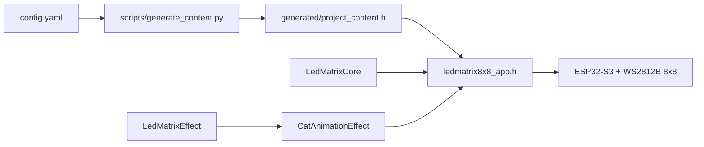
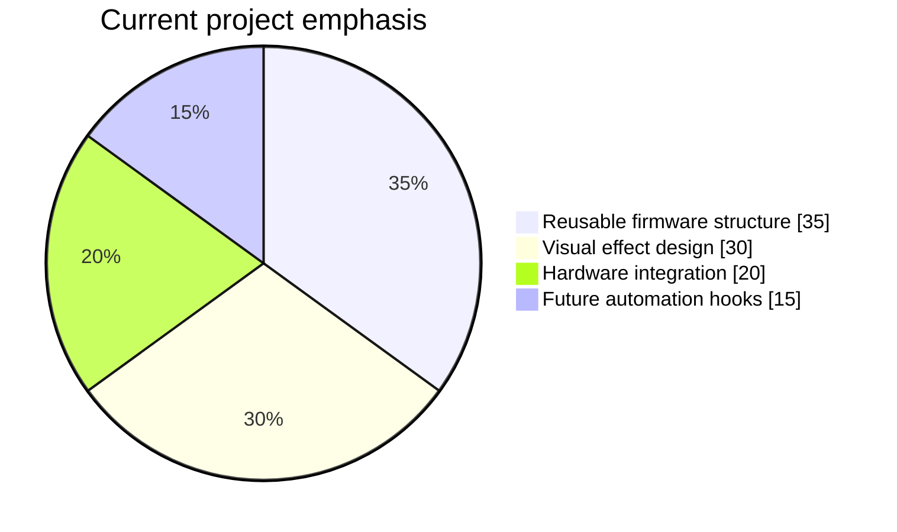

<p align="center">
  
</p>

<p align="center">
  
  
  
  
  
</p>

<p align="center">
  
  
  
</p>

<p align="center">
  <a href="#pt-br">PT-BR</a> •
  <a href="#english">English</a> •
  <a href="#visual-preview">Visual Preview</a> •
  <a href="#architecture--schema">Architecture</a> •
  <a href="#project-chart">Chart</a> •
  <a href="#library-layout">Library Layout</a> •
  <a href="#quick-start">Quick Start</a>
</p>

## PT-BR

`ledmatrix8x8` é um badge/painel NeoPixel 8x8 baseado em `ESP32-S3`, pensado para virar uma base de efeitos visuais importáveis. O firmware carregado no dispositivo hoje mostra um rosto de gato estático com identidade própria, mas a arquitetura foi organizada para permitir trocar o comportamento com baixo atrito: um núcleo da matriz, uma interface de efeitos e efeitos separados como biblioteca local.

O objetivo deixou de ser “um sketch de teste” e passou a ser um artefato de hardware pequeno, visualmente marcante e com código reaproveitável.

## English

`ledmatrix8x8` is an `ESP32-S3` NeoPixel 8x8 badge built around reusable visual effects. The device currently runs a cat-face effect, while the codebase is organized as a small importable firmware stack: matrix core, effect interface, and swappable local effects.

The goal is no longer a throwaway test sketch. It is now a compact hardware artifact with stronger visual direction and a reusable firmware structure.

## Visual Preview

<p align="center">
  
</p>

## Current Snapshot

| Item | Status |
| --- | --- |
| Current deployed effect | Static cat face |
| Device target | `ESP32-S3-DevKitC-1` |
| LED matrix | `WS2812B 8x8` |
| Data pin | `GPIO38` |
| Build system | `PlatformIO` |
| Firmware style | Local library-based effects |

## Architecture / Schema



## Project Chart



## Library Layout

| Layer | Path | Responsibility |
| --- | --- | --- |
| App | `ledmatrix8x8_app.h` | Wires the selected effect into the runtime |
| Core | `lib/LedMatrixCore/src/LedMatrixCore.h` | Matrix abstraction, coordinates, color, draw helpers |
| Effect contract | `lib/LedMatrixEffects/src/LedMatrixEffect.h` | Common interface for importable effects |
| Effect | `lib/LedMatrixEffects/src/CatAnimation.h` | Current cat-face effect |
| Generated config | `generated/project_content.h` | Build-time constants generated from config |
| Content source | `config.yaml` | Human-edited project config |

## Why This Direction

- The firmware is now structured to swap effects without rewriting the whole project.
- The matrix core can be reused by text effects, status indicators, or future animations.
- The current cat effect gives the badge a visual identity instead of looking like a generic LED test.
- The repo is ready to grow into multiple behaviors rather than a single monolithic sketch.

## Quick Start

1. Edit `config.yaml`
2. Run `python scripts/generate_content.py`
3. Run `pio run`
4. Flash with `pio run -t upload --upload-port /dev/ttyACM0`

## How To Swap The Active Effect

The main app only instantiates one effect:

```cpp
#include <CatAnimation.h>

static CatAnimationEffect currentEffect(PROJECT_CAT_FRAME_MS);
```

To add another behavior, create a new header under `lib/LedMatrixEffects/src/` implementing `LedMatrixEffect`, then swap the instance in `ledmatrix8x8_app.h`.

## Hardware

- `ESP32-S3-DevKitC-1`
- `WS2812B 8x8`
- `GPIO38`

If your matrix is wired differently, update `MATRIX_ZIGZAG` and `ORIGIN_BOTTOM` in `ledmatrix8x8_app.h`.

## Useful Directions

- Build more effects: blink, idle pulse, side-profile cat, tiny text scroller, status glyphs.
- Add an effect selector later without changing the core matrix library.
- Reuse the same runtime for Kanban/Obsidian-inspired modes in future iterations.

## Reference Docs

- Product context: [PROJECT_CONTEXT.md](PROJECT_CONTEXT.md)
- Inspirations and integrations: [docs/INSPIRATIONS.md](docs/INSPIRATIONS.md)
