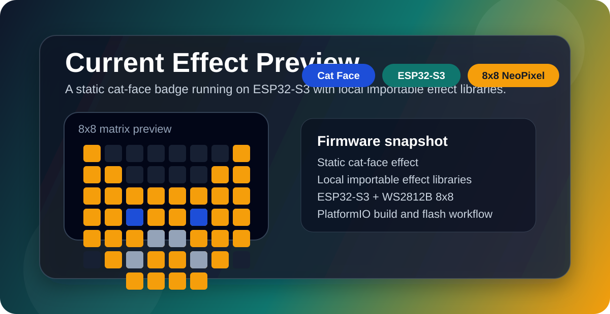
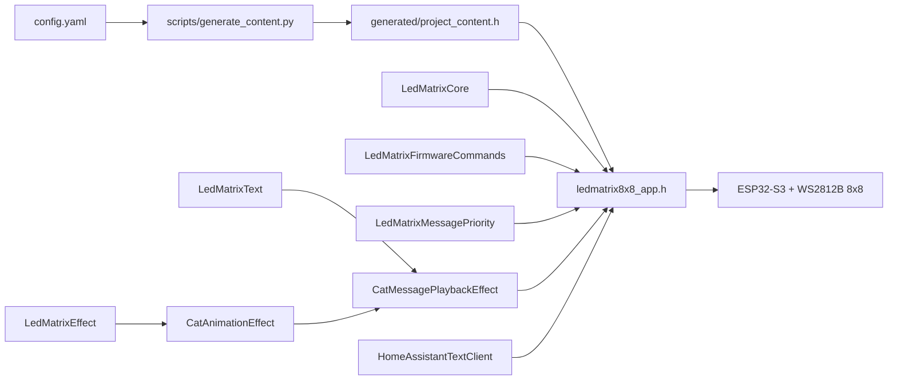
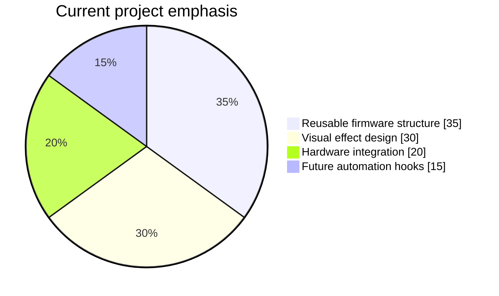

<p align="center">
  
</p>

<p align="center">
  
  
  
  
  
</p>

<p align="center">
  
  
  
</p>

<p align="center">
  <a href="#pt-br">PT-BR</a> •
  <a href="#english">English</a> •
  <a href="#visual-preview">Visual Preview</a> •
  <a href="#architecture--schema">Architecture</a> •
  <a href="#project-chart">Chart</a> •
  <a href="#library-layout">Library Layout</a> •
  <a href="#quick-start">Quick Start</a>
</p>

## PT-BR

`ledmatrix8x8` é um badge/painel NeoPixel 8x8 baseado em `ESP32-S3`, pensado para virar uma base de efeitos visuais importáveis. O firmware agora alterna entre o rosto do gato e um letreiro 5x7 com mensagens configuraveis, mantendo a arquitetura separada em nucleo da matriz, interface de efeitos e bibliotecas locais reaproveitaveis.

O objetivo deixou de ser “um sketch de teste” e passou a ser um artefato de hardware pequeno, visualmente marcante e com código reaproveitável.

## English

`ledmatrix8x8` is an `ESP32-S3` NeoPixel 8x8 badge built around reusable visual effects. The device now alternates between a cat-face effect and a configurable 5x7 scrolling marquee, while the codebase stays organized as a small importable firmware stack: matrix core, effect interface, and swappable local libraries.

The goal is no longer a throwaway test sketch. It is now a compact hardware artifact with stronger visual direction and a reusable firmware structure.

## Visual Preview

<p align="center">
  
</p>

## Current Snapshot

| Item | Status |
| --- | --- |
| Current deployed effect | Cat face + scrolling text |
| Validation status | `make check` green |
| Device target | `ESP32-S3-DevKitC-1` |
| LED matrix | `WS2812B 8x8` |
| Data pin | `GPIO38` |
| Build system | `PlatformIO` |
| Firmware style | Local library-based effects |

## Architecture / Schema



## Project Chart



## Library Layout

| Layer | Path | Responsibility |
| --- | --- | --- |
| App | `ledmatrix8x8_app.h` | Wires the selected effect into the runtime; handles serial commands and HA callbacks |
| Core | `lib/LedMatrixCore/src/LedMatrixCore.h` | Matrix abstraction, coordinates, color, draw helpers |
| Color parser | `lib/LedMatrixCore/src/LedMatrixColorParser.h` | Parses `r,g,b` and `#RRGGBB` color strings |
| Firmware commands | `lib/LedMatrixCore/src/LedMatrixFirmwareCommands.h` | Parses BRIGHTNESS/EFFECT commands; formats HA error summaries |
| Message priority | `lib/LedMatrixCore/src/LedMatrixMessagePriority.h` | Resolves Serial > HomeAssistant > Config source priority |
| Effect contract | `lib/LedMatrixEffects/src/LedMatrixEffect.h` | Common interface for importable effects |
| Cat effect | `lib/LedMatrixEffects/src/CatAnimation.h` | Pixel cat animation library |
| Text lib | `lib/LedMatrixText/src/TextMarquee.h` | 5x7 sprite marquee with editable message text |
| Playback effect | `lib/LedMatrixEffects/src/CatMessagePlayback.h` | Alternates cat idle and scrolling messages |
| HA client | `lib/LedMatrixIntegrations/src/HomeAssistantTextClient.h` | Polls HA REST API; manages Wi-Fi lifecycle |
| Generated config | `generated/project_content.h` | Build-time constants generated from config |
| Content source | `config.yaml` | Human-edited project config |

## Why This Direction

- The firmware is now structured to swap effects without rewriting the whole project.
- The matrix core can be reused by text effects, status indicators, or future animations.
- The cat effect gives the badge a visual identity instead of looking like a generic LED test.
- The text marquee turns the badge into a practical display for short messages and status lines.
- The repo is ready to grow into multiple behaviors rather than a single monolithic sketch.

## Quick Start

1. Prepare o ambiente local:

```bash
make setup
```

2. Edite `config.yaml` e, se for usar Wi-Fi/Home Assistant, copie `include/ledmatrix8x8_secrets.example.h` para `include/ledmatrix8x8_secrets.h`.
3. Compile o firmware:

```bash
make build
```

4. Faça upload para o ESP32 conectado via USB:

```bash
make upload PORT=/dev/ttyACM0
```

5. Confira o diagnostico serial:

```bash
make status PORT=/dev/ttyACM0
```

Os comandos `make` usam o PlatformIO instalado na `.venv`. Se preferir rodar direto, use `PATH="$PWD/.venv/bin:$PATH" pio run`.

Example message:

```json
{
  "text": "Olá, eu sou o Klein, seu gato assistente virtual",
  "color": [255, 140, 0]
}
```

## Serial Override

Com o firmware rodando, voce pode controlar tudo sem reflash pelo monitor serial em `115200`:

```text
TEXT:Olá, eu sou o Klein
COLOR:255,140,0
BRIGHTNESS:80
EFFECT:cat
EFFECT:playback
STATUS
CLEAR
HELP
```

Regras:

- `TEXT:mensagem` ativa um override temporario e exibe essa mensagem no letreiro.
- `COLOR:r,g,b` define a cor usada no proximo `TEXT:`; cada componente deve estar entre `0` e `255`.
- `BRIGHTNESS:n` ajusta o brilho imediatamente (0–255) sem reflash.
- `EFFECT:cat` troca para o modo so-gato (sem marquee). `EFFECT:playback` volta ao modo normal.
- `CLEAR` remove o override manual. Se o Home Assistant tiver mensagem ativa, ele reassume com a cor HA atual; se nao tiver, volta para o `config.yaml`.
- `STATUS` mostra fonte atual, override, cor serial, cor HA, efeito ativo, brilho, Wi-Fi, IP, ultimo HTTP, ultimo erro e ultimo poll.
- `HELP` lista todos os comandos disponiveis.
- O texto e normalizado para o charset suportado pela fonte 5x7 (ASCII uppercase).

Tambem existe o wrapper Python com auto-detect de porta:

```bash
make status PORT=/dev/ttyACM0

# ou via script direto (porta auto-detectada se omitida):
.venv/bin/python scripts/send.py text --color 255,140,0 "Ola Klein"
.venv/bin/python scripts/send.py brightness 80
.venv/bin/python scripts/send.py effect cat
.venv/bin/python scripts/send.py clear
.venv/bin/python scripts/send.py --port /dev/ttyACM0 status
```

## Home Assistant

O firmware agora pode buscar uma mensagem do Home Assistant por Wi-Fi usando a REST API.

Arquivos:

- o template tracked fica em `include/ledmatrix8x8_secrets.example.h`
- o arquivo real fica em `include/ledmatrix8x8_secrets.h`
- `include/ledmatrix8x8_secrets.h` esta ignorado no Git

Configuracao local esperada:

```cpp
#define LEDMATRIX_WIFI_SSID "nome_da_rede_wifi"
#define LEDMATRIX_WIFI_PASSWORD "senha_wifi"
#define LEDMATRIX_HA_BASE_URL "local_ip_home_assistant"
#define LEDMATRIX_HA_ACCESS_TOKEN "SEU_LONG_LIVED_ACCESS_TOKEN"
#define LEDMATRIX_HA_ENTITY_ID "input_text.ledmatrix8x8_message"
#define LEDMATRIX_HA_COLOR_ENTITY_ID "input_text.ledmatrix8x8_color"
```

Fluxo:

1. Crie um Long-Lived Access Token no perfil do Home Assistant.
2. Garanta que existam os helpers `input_text.ledmatrix8x8_message` e `input_text.ledmatrix8x8_color`.
3. Faça upload do firmware.
4. Quando o helper de mensagem mudar, a matriz assume essa mensagem.
5. Quando o helper de cor mudar, a matriz aceita `r,g,b` (`0,255,160`) ou hexadecimal (`#00FFA0`).

Observacoes:

- O override manual por `TEXT:` continua com prioridade sobre o Home Assistant.
- Se o helper de mensagem ficar vazio, a matriz volta para o playback padrao do `config.yaml`.
- Se o helper de cor ficar vazio, `unknown`, `unavailable` ou invalido, a matriz volta para a cor HA padrao do `config.yaml`.
- `STATUS` e o log serial ajudam a diagnosticar Wi-Fi, HTTP e o ultimo estado recebido.

## How To Swap The Active Effect

The main app instantiates one playback effect that already combines the cat library and the text library:

```cpp
#include <CatMessagePlayback.h>

static CatMessagePlaybackEffect currentEffect(
  PROJECT_CAT_FRAME_MS,
  PROJECT_CAT_LOOPS,
  PROJECT_SCROLL_STEP_MS,
  PROJECT_MESSAGE_PAUSE_MS,
  PROJECT_MESSAGES,
  PROJECT_MESSAGE_COUNT
);
```

To add another behavior, create a new header under `lib/LedMatrixEffects/src/` implementing `LedMatrixEffect`, then swap the instance in `ledmatrix8x8_app.h`.

## Hardware

- `ESP32-S3-DevKitC-1`
- `WS2812B 8x8`
- `GPIO38`

If your matrix is wired differently, update `MATRIX_ZIGZAG` and `ORIGIN_BOTTOM` in `ledmatrix8x8_app.h`.

## Useful Directions

- Build more effects: blink, idle pulse, side-profile cat, tiny text scroller, status glyphs.
- Add an effect selector later without changing the core matrix library.
- Reuse the same runtime for Kanban/Obsidian-inspired modes in future iterations.
- Keep the project TODO updated in [`TODO.md`](TODO.md).

## Reference Docs

- Product context: [PROJECT_CONTEXT.md](PROJECT_CONTEXT.md)
- Project TODO: [TODO.md](TODO.md)
- Inspirations and integrations: [docs/INSPIRATIONS.md](docs/INSPIRATIONS.md)
